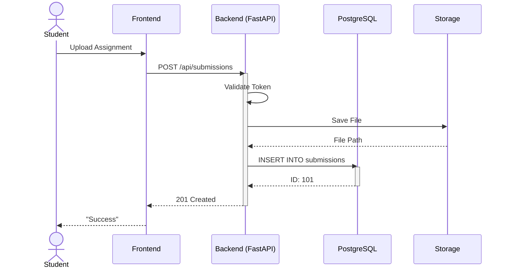
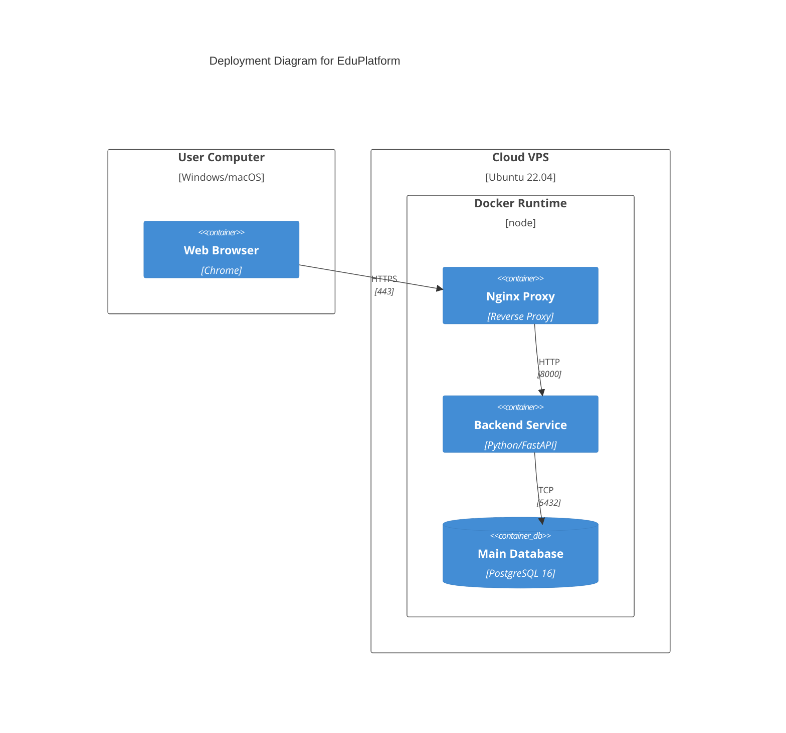

# Product Architecture

## Product choice
* **Name:** EduPlatform (Educational Management System)
* **Description:** A comprehensive platform for colleges in Kazakhstan designed to automate document filling and manage the educational process. It features distinct roles for Administrators, Teachers, and Students.
* **Link:** https://github.com/nurassyl-edu-project (Placeholder)

## Motivation
As a student at JIHC and a backend developer, I am deeply interested in how educational processes can be optimized. Building this system allows me to apply my skills in **FastAPI** and **PostgreSQL** to solve real-world problems. It is a perfect opportunity to practice architecting a role-based access control system.

## Main components

1.  **Web Frontend (SPA):** The user interface for students and teachers. Handles user interactions and displays data.
2.  **API Gateway (Nginx):** The entry point for all requests. Handles reverse proxying and load balancing.
3.  **Backend API (FastAPI):** The core logic. Processes requests, handles business logic (grading, docs), and exposes a REST API.
4.  **Database (PostgreSQL):** Stores user data, courses, grades, and documents.
5.  **Auth Service:** Middleware responsible for JWT authentication and role-based permission checks.

### Component Diagram

```mermaid
componentDiagram
    component "User Browser" as Client
    component "API Gateway (Nginx)" as Gateway
    component "Backend API (FastAPI)" as Backend
    component "Database (PostgreSQL)" as DB
    component "Document Storage (Local/S3)" as Storage

    Client --> Gateway : HTTPS / JSON
    Gateway --> Backend : Proxied Requests
    Backend --> DB : SQL Queries (SQLAlchemy)
    Backend --> Storage : Save/Load Files
```
Data flow
Scenario: A Student submits a Lab Assignment.

User Action: Student uploads a file via Web Frontend.

Request: Frontend sends POST /api/submissions to Gateway.

Processing:

Backend validates token (Auth).

Backend saves file to Storage.

Backend creates record in PostgreSQL.

Response: Backend returns 201 Created.

Sequence Diagram
Code snippet

Deployment
User Devices: Web browsers.

Server: Cloud VPS (Linux/Ubuntu).

Docker Compose: Orchestrates containers.

Nginx: Exposed port 443.

PostgreSQL: Private volume.

Deployment Diagram
Code snippet

Knowledge Gaps
File Storage: Need to learn how to migrate from local storage to S3 object storage for scalability.

WebSockets: Need to figure out how to implement real-time notifications for teachers in FastAPI.
