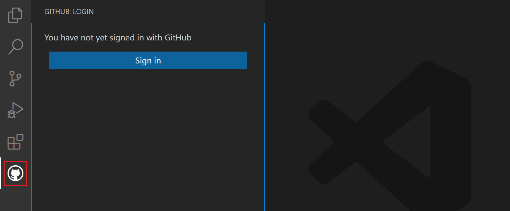

# Lab Setup

Complete these steps before starting the tasks.

## 1. Set up a fork

1. Create a `GitHub` account if you don't have one.
2. Fork this repo to your `GitHub` account and make it public.
3. In the repo -> `Settings` -> `General` -> `Features`, enable `Issues`.
4. <details><summary>(Optional) Create a label for tasks.</summary>

   In the repo -> `Issues` -> `Labels`, create a new label:
   1. Click `New label`.
   2. Name: `task`.
   3. Click `Create label`.

   </details>

5. <details><summary>(Optional) Protect your <code>main</code> branch.</summary>

   In the repo -> `Settings` -> `Code and automation` -> `Add branch ruleset`:
   1. `Ruleset Name`: `push`
   2. `Enforcement status`: `Active`
   3. `Target branches` -> `Add target` -> `Include default branch`
   4. Rules:
      - [x] `Restrict deletions`
      - [x] `Require a pull request before merging`:
         - `Required approvals`: `1`
         - `Require conversation resolution before merging`
         - `Allowed merge methods`: `Merge`.
      - [x] Block force pushes

   </details>

## 2. Find a partner and add them as collaborator

1. Find a classmate to be your partner for this lab.
2. In the repo `Settings` -> `Collaborators` -> `Add people`, add your partner as a collaborator.
3. Make sure your partner has accepted the invitation sent to their email.

## 3. Set up your local tools

1. Configure `git` on your computer (if not already done):

    ```bash
    git config --global user.name "Your Name"
    git config --global user.email "your@email"
    ```

2. (Optional) New to git? Watch [How Git Works: Explained in 4 Minutes](https://www.youtube.com/watch?v=e9lnsKot_SQ).

3. Install [`VS Code`](https://code.visualstudio.com/).

4. Get familiar with VS Code:

    **Open the Terminal** (you'll use this for git commands):
    - Press `` Ctrl+` `` (or `` Cmd+` `` on Mac)
    - Or: Menu → `View` → `Terminal`
    - You should see a panel at the bottom where you can type commands

    

    **Find Source Control** (you'll use this to commit changes):
    - Click the branch icon in the left sidebar (third icon from top)
    - Or press `Ctrl+Shift+G` (`Cmd+Shift+G` on Mac)
    - You should see a panel showing changed files

    

5. Enable helpful settings:
    - **Auto-save:** Menu → `File` → `Auto Save` (click to enable)
      - *Why:* Saves your work automatically so you don't lose changes if VS Code crashes
    - **Format-on-save:** See [VS Code docs](https://code.visualstudio.com/docs/editing/codebasics#_formatting)
      - *Why:* Automatically formats your code when you save, keeping it clean and readable

## 4. Clone and open the repository

1. On your computer, create a directory `software-engineering-toolkit`.
2. Clone your forked repo:

    ```bash
    git clone https://github.com/<your-username>/lab-01-market-product-and-git
    ```

3. Open the repo in VS Code:

    ```bash
    cd software-engineering-toolkit
    code lab-01-market-product-and-git
    ```

## 5. Set up VS Code extensions

1. **Install recommended extensions:**
   - When you open the repo, VS Code will show a popup: "Do you want to install the recommended extensions?"
   - Click `Install`

   

   If you missed the popup:
   - Press `Ctrl+Shift+X` (`Cmd+Shift+X` on Mac) to open Extensions
   - Type `@recommended` in the search bar
   - Install all recommended extensions

2. **Sign in to GitHub:**
   - Click the person icon at the bottom of the left sidebar (`Accounts`)
   - Click `Sign in with GitHub to use GitHub Pull Requests...`
   - Follow the prompts in your browser

   

3. <details><summary>(Optional) Check GitLens.</summary>

    In the `Status Bar`:
    1. Click `Visualize commits on the Commit Graph`.
    2. Make sure you can see the commit graph.

    In the `Activity Bar`:
    1. Click `Source Control`.
    2. Click `GitLens` in the opened `Primary Side Bar`.
    3. In the `GitLens` panel, click `Remotes` - verify `origin` points to your repo.
    4. Click `Commits` - verify you can see commits.

    Learn more about [`GitLens` features](https://help.gitkraken.com/gitlens/gitlens-features/).

   </details>

4. <details><summary>(Optional) Set up a free coding agent.</summary>

    1. Watch the [tutorial](https://youtube.com/shorts/SQ-bwPDIrVY).
    2. Set up [`Roo Code`](https://roocode.com/) or another coding agent with [`Qwen3 Coder`](https://github.com/QwenLM/Qwen3-Coder) or another free model from [`OpenRouter`](https://openrouter.ai/collections/free-models).

  </details>

---

**Setup complete!** Return to the [main README](../README.md) and start with Task 0.
